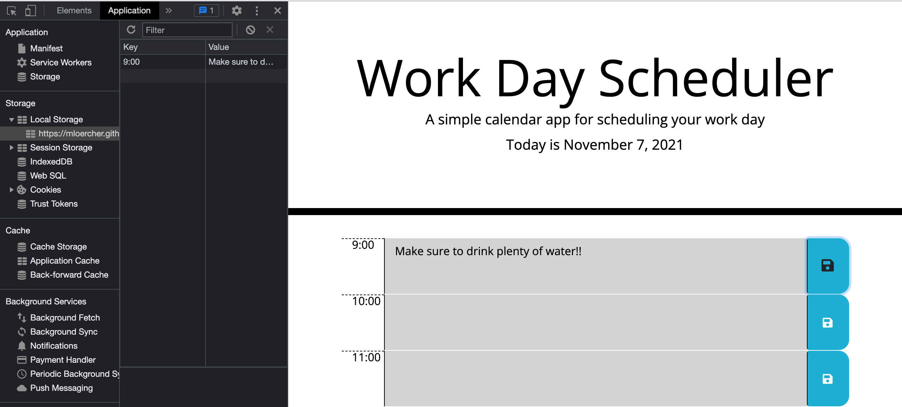

# plan-your-workday

## Description
Plan your workday with the plan-your-workday app! This application has local storage persistance and color coded timeblocks for the past, present and future hours. Once a task is saved, webpage can be closed and/or refreshed while maintaining user entries in the corresponding timeblocks. 

### Persistance

**User entry is saved in local storage

### Current Date is displayed

Link to application: https://mloercher.github.io/plan-your-workday/